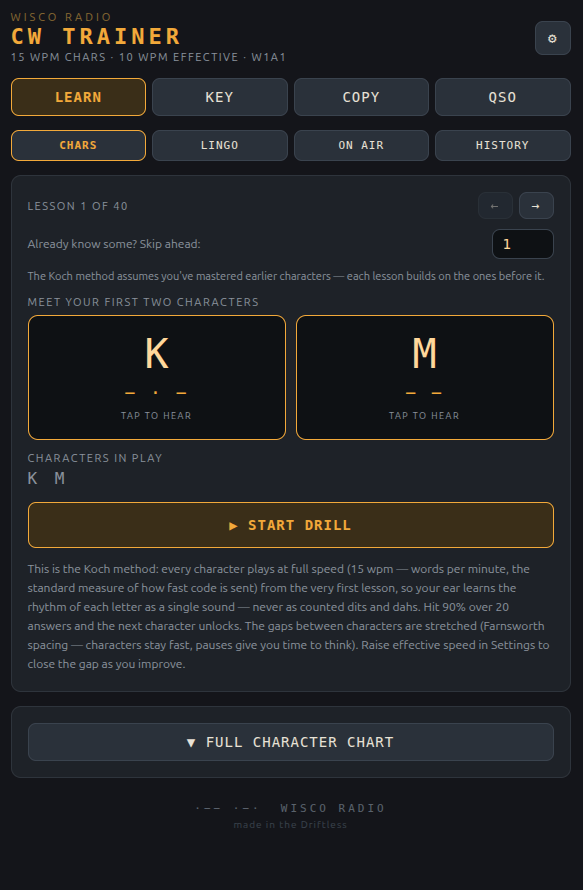
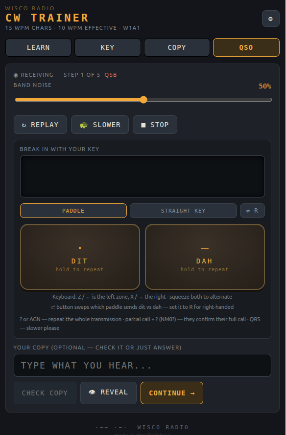
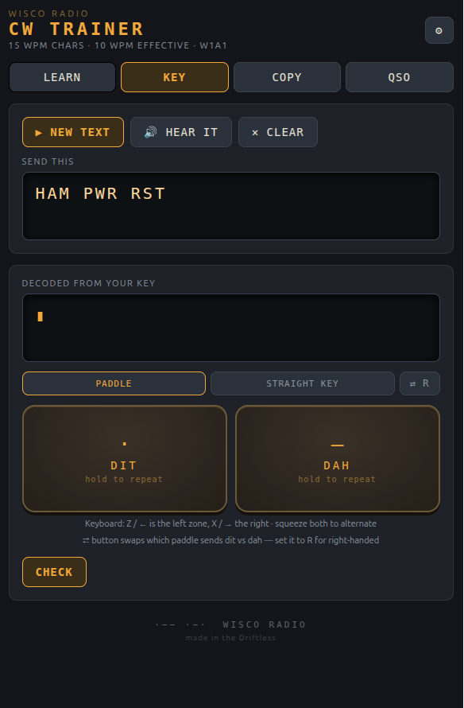
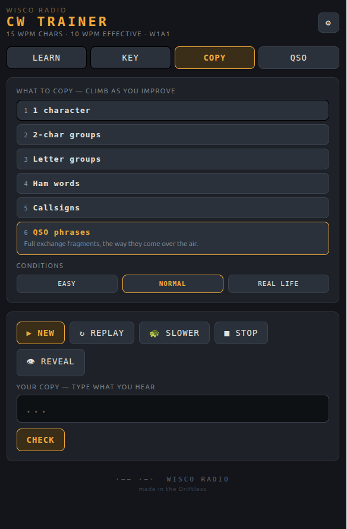
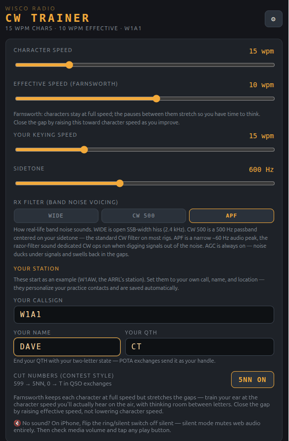

# WISCO RADIO — CW Trainer

A detailed amateur-radio Morse code (CW) trainer for the Linux desktop: Koch-method
lessons, copy and sending practice, and a full QSO simulator — from your first two
characters all the way to a complete on-air contact. Built with
[Electron](https://www.electronjs.org/) and packaged for the **Snap Store**.

[](https://www.gnu.org/licenses/gpl-3.0)


- **App ID:** `io.github.wiscoradio_k9mte.CWTrainer`
- **License:** GPL-3.0-or-later
- **Author:** Travis Engh (K9MTE) — Wisco Radio

The trainer's UI lives in one file (`wr-cw-trainer.jsx`), with its pure logic — Morse
tables, Farnsworth timing, copy grading, and the QSO generators — factored into
`src/cw-core.js` and covered by a unit-test suite. The repo wraps it with a build system
(Vite) and packaging (electron-builder + snapcraft) so it can ship to the Snap Store.

---

## Contents

- [Features](#features)
- [Screenshots](#screenshots)
- [Install](#install)
- [Develop & run](#develop--run)
- [Testing](#testing)
- [Project layout](#project-layout)
- [Contributing](#contributing)
- [Package for the store](#package-for-the-store)
- [Notes & troubleshooting](#notes--troubleshooting)
- [License](#license)

---

## Features

- **Koch-method character lessons** — every character at full speed from lesson one,
  with Farnsworth spacing and one new character added at 90% accuracy.
- **A six-rung copy ladder** — single characters, pairs, random groups, ham words,
  callsigns, and full QSO phrases.
- **Sending practice** with a built-in iambic paddle and straight-key decoder that shows
  exactly what your fist sends — including the HH "start over" error prosign. Key on screen,
  with the keyboard (Space for a straight key; Z / X or the arrow keys for paddle), or with
  **your own paddle or straight key through a USB adapter** — VBand-style adapters in
  keyboard mode send the `[` / `]` bracket keys, which the trainer accepts for dit / dah
  (use the dit/dah swap toggle if your levers come out reversed).
- **A QSO simulator** with POTA, SOTA, IOTA, and ragchew contacts, on-air break-in fills
  (`?`, `AGN`, `QRS`, partial-call fills), and honest signal reports.
- **Realistic band conditions** — selectable receiver filtering (wide / CW 500 Hz / APF),
  QSB signal fading, and AGC.
- **Reference guides** on CW lingo, on-air procedure, and the history of the code.
- **Fully offline** — no network access is requested or used.

---

## Screenshots







---

## Install

### From the store

Once published, install with a single command:

```bash
# Snap (planned)
sudo snap install wr-cw-trainer
```

> Not on the store yet — until then, build it from source.

### Build & run from source

Requires **Node.js 18+** and npm.

```bash
git clone https://github.com/wiscoradio-k9mte/CW-Trainer.git
cd CW-Trainer
npm install
npm start        # builds the app and runs it in Electron
```

The icon (`build/icon.png`) and the GPL-3.0 `LICENSE` are already in the repo, so
`npm install` is the only setup step.

---

## Develop & run

```bash
npm run dev      # Vite dev server + Electron, with hot reload
```

This launches the Vite dev server on `http://localhost:5173` and opens Electron pointed
at it. Edit `wr-cw-trainer.jsx` and the window reloads.

```bash
npm start        # build for production, then run it in Electron (no dev server)
```

Use `npm start` to confirm the **packaged-style** load works (assets served from `dist/`
over `file://`) — this is what catches base-path problems before you package.

---

## Testing

The pure logic — the Morse table, Farnsworth timing, the copy grader, the QSO
generators, and the Koch advancement gate — lives in `src/cw-core.js` and is covered by a
[vitest](https://vitest.dev/) suite:

```bash
npm test            # run the suite once
npm run test:watch  # re-run on change while developing
```

Keep the suite green, and add tests for any new logic you put in `cw-core.js` — that's the
bar a change has to clear. UI behavior in `wr-cw-trainer.jsx` is checked by hand (`npm run dev`).

---

## Project layout

```
.
├── wr-cw-trainer.jsx        # the UI — the whole trainer (components + hooks), one file
├── src/
│   ├── cw-core.js           # pure logic: Morse tables, timing, grading, QSO builders
│   ├── cw-core.test.js      # unit tests for cw-core.js (vitest)
│   └── main.jsx             # React entry: mounts the trainer into the page
├── index.html               # Vite HTML entry
├── vite.config.mjs          # bundler config (base: "./" for Electron)
├── electron/main.cjs        # Electron main process (creates the window)
├── electron-builder.yml     # produces the unpacked Electron tree that snapcraft packages
├── snap/snapcraft.yaml      # Snap package definition (core22 + gnome extension)
├── build/
│   ├── icon.png             # app icon (square PNG, 1024² ideal)
│   ├── screenshots/         # store-listing images (referenced by metainfo.xml)
│   └── io.github.wiscoradio_k9mte.CWTrainer.metainfo.xml  # store metadata
├── LICENSE                  # GPL-3.0 full text
├── package.json
└── release/                 # build output (created by electron-builder / snapcraft)
```

> **Replacing the icon:** drop a square PNG (512×512 or larger; 1024² is ideal so every
> generated size stays crisp) at `build/icon.png`. electron-builder picks it up
> automatically — `build/` is its `buildResources` directory.

---

## Contributing

Contributions are welcome. This is a community project for amateur-radio operators
learning CW, and real-world feedback from people who actually operate is what makes it
better — bug reports, fixes, and feature ideas are all genuinely valued.

**Get set up**

```bash
git clone https://github.com/wiscoradio-k9mte/CW-Trainer.git
cd CW-Trainer
npm install
npm run dev        # run with hot reload
npm test           # run the test suite
```

**Where the code lives**

- **`wr-cw-trainer.jsx`** — the entire UI in one file, organized into clearly named hooks
  and components: the audio/tone engine (`useMorsePlayer`), the keyer + decoder
  (`useKeyer`), the copy/sending/QSO trainers, the settings panel, and the reference
  guides. It's long but sectioned — search for the part you want.
- **`src/cw-core.js`** — the pure, testable logic (Morse tables, timing, grading, QSO
  builders, the Koch gate). New logic belongs here so it can be unit-tested.
- **`electron/main.cjs`** — the Electron main process (window creation and security).

**Submit a change**

1. Fork, then branch from `main` and keep the change focused.
2. **Keep `npm test` green**, and add tests for any new logic in `cw-core.js` — a change to
   the core that isn't covered won't be merged.
3. For UI changes, run `npm run dev` and confirm the flow by hand.
4. Open a pull request that explains what changed and why.

**Report a bug or suggest a feature**

Open an [issue](https://github.com/wiscoradio-k9mte/CW-Trainer/issues). Bug reports with
steps to reproduce, and feature ideas grounded in how you actually operate, are the most
useful — good community ideas get worked in as enhancements. Be kind in issues and
reviews; we're all here to help more people learn the code.

---

## Package for the store

Install the packaging tool first:

- **snapcraft** — `sudo snap install snapcraft --classic`

### Snap

```bash
npm run dist:snap         # → release/wr-cw-trainer_1.0.0_amd64.snap
```

Test it locally before publishing:

```bash
sudo snap install --dangerous release/wr-cw-trainer_*.snap
wr-cw-trainer             # launch it
sudo snap remove wr-cw-trainer
```

Publish to the **Snap Store**:

```bash
snapcraft login
snapcraft register wr-cw-trainer     # one-time; the name must be globally unique
snapcraft upload --release=stable release/wr-cw-trainer_*.snap
```

> The snap **name** (`wr-cw-trainer` in `package.json`) must be available and registered
> to your account. If it's taken, pick a variant (e.g. `wiscoradio-cw-trainer`) and
> update the `name` field in `package.json`.

---

## Notes & troubleshooting

- **Blank white window when packaged?** That's almost always the asset base path.
  `vite.config.mjs` sets `base: "./"` precisely to avoid it — keep it.
- **No audio in the sandbox?** Snap needs the `audio-playback` plug (already configured).
  Connect it if it didn't auto-connect: `sudo snap connect wr-cw-trainer:audio-playback`.
- **No network access** is requested — the trainer is fully offline. Don't add it unless
  you introduce a feature that needs it.
- **Generic taskbar icon after install?** That's a `StartupWMClass` mismatch — cosmetic.
  The snap desktop file (`snap/local/cw-trainer.desktop`) sets `StartupWMClass=wr-cw-trainer`;
  if a future build changes the window class, confirm it with `xprop WM_CLASS` (X11) or the
  Wayland app-id and update that value.

---

## License

GPL-3.0-or-later © 2026 Travis Engh (K9MTE). See [LICENSE](LICENSE) for the full text.
