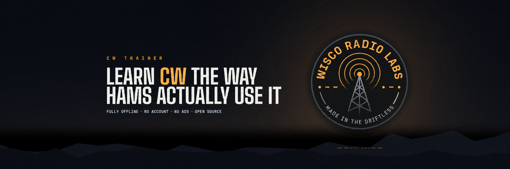
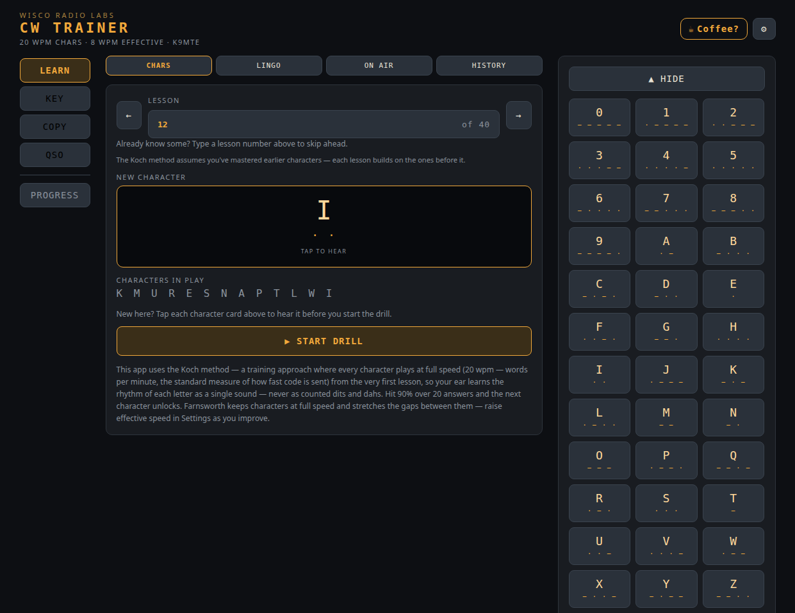
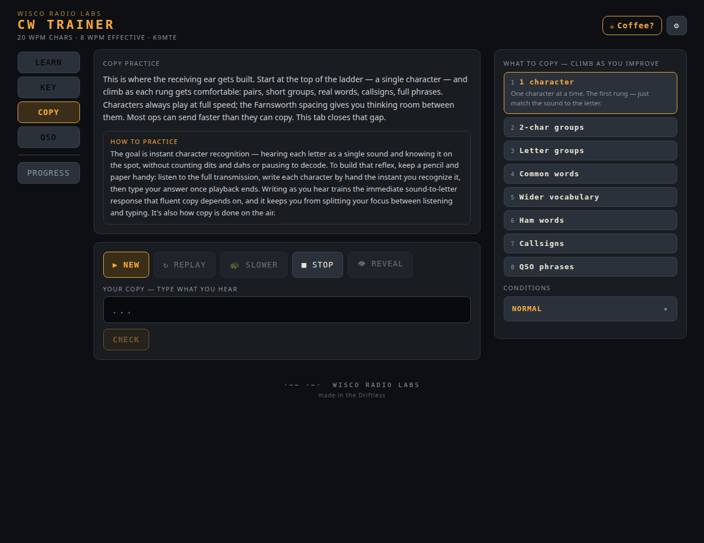
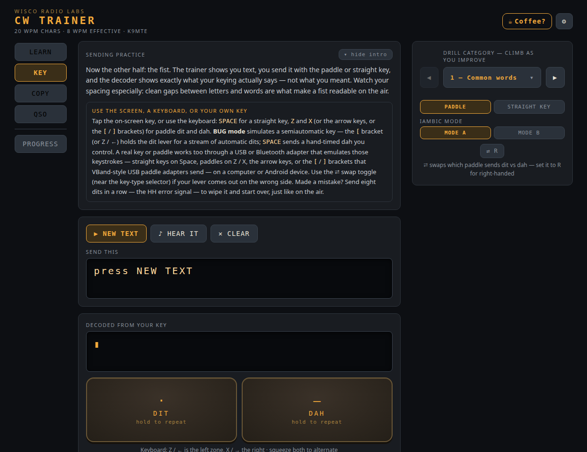
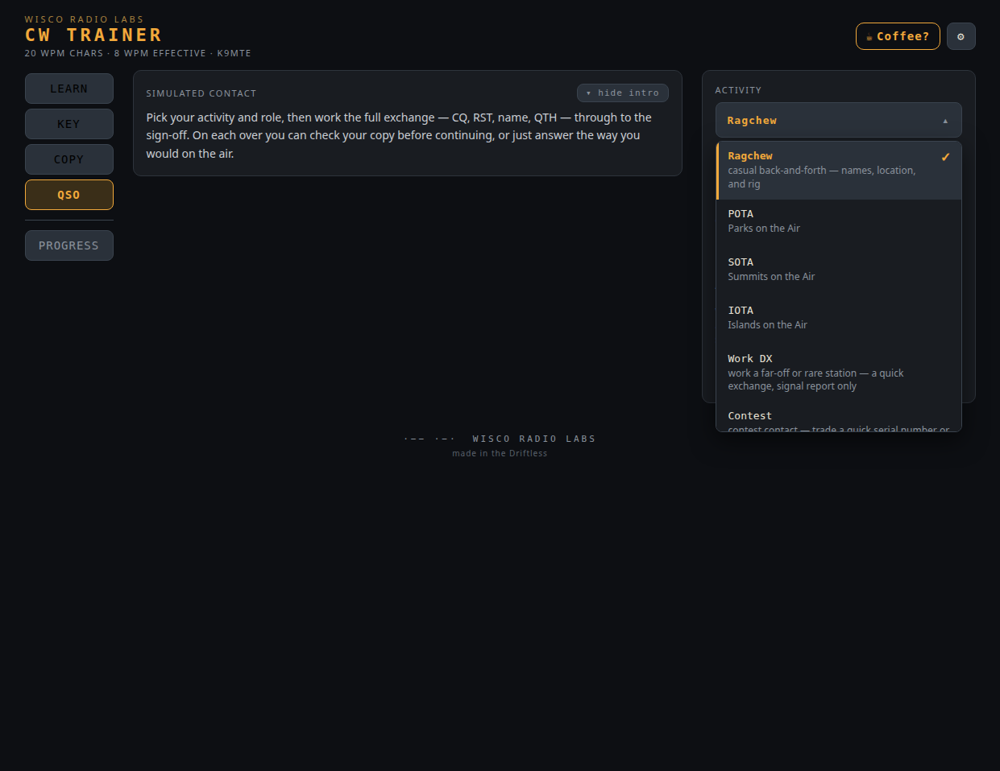
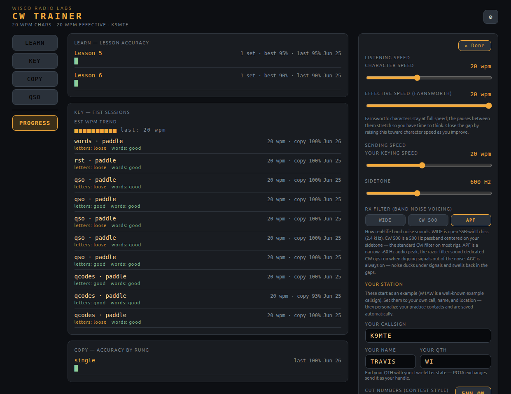

<p align="center">
  
</p>

<h1 align="center">CW Trainer</h1>

<p align="center">
  <em>by Wisco Radio Labs</em><br><br>
  Learn Morse code the way hams actually use it — from your first two characters to a full on-air contact.<br>
  Koch-method lessons · copy &amp; sending practice · a ragchew / POTA / SOTA / IOTA / DX / contest QSO simulator. <b>Fully offline.</b>
</p>

<p align="center">
  <a href="https://www.gnu.org/licenses/gpl-3.0"></a>
  
  
</p>

---

## What it is

A free, fully-offline Morse code (CW) trainer for the Linux desktop, built by a ham for hams.
Whether you've never sent a dit or you're knocking the rust off, four practice modes take you
all the way from recognizing your first two characters to running a complete on-air contact —
**no account, no network, no ads.**

- 🎧 **Audio-first**, the way CW is really learned — full-speed characters with Farnsworth spacing.
- 🛠️ **Bring your own key** — practice on screen, on the keyboard, or with your real straight key or
  paddle through a VBand-style USB adapter.
- 📻 **Real operating, simulated** — work ragchew, POTA, SOTA, IOTA, DX, and contest contacts as either side of the QSO.
- 🌍 **Work the world** — a bundled DXCC dataset drives realistic foreign prefixes, callsigns, and DX/contest exchanges.
- 📈 **See your progress** — lessons, sending, copy, and QSO accuracy scored across sessions, with simple trends and dates.
- 🔌 **Offline forever** — it never asks for the network.

---

## Screenshots

|  |  |
|:--:|:--:|
| <br>**Learn** — Koch-method character lessons | <br>**Copy** — the eight-rung copy ladder |
| <br>**Key** — sending practice with a live decoder | <br>**QSO** — work a simulated contact |
| <br>**Progress &amp; Settings** — track your sessions; tune speed, Farnsworth, sidetone, band conditions | |

---

## Using the trainer

The app opens with five tabs across the top — four practice modes plus a progress view:

### 📚 Learn
Koch-method character lessons. Every character is sent at full speed from the very first lesson,
with extra space between characters (Farnsworth) so your ear has time. A new character is added
once you're copying the current set at 90%. Answer by tapping the on-screen letter or just typing it.

### 📥 Copy
Copy practice up an eight-rung ladder — single characters, two-character groups, random letter
groups, common words, a wider vocabulary, real ham words, callsigns, and finally full QSO
phrases. The word rungs draw on a frequency-ranked English list built from public-domain texts
("Common words" is the top 500; "Wider vocabulary" steps up to ranks 1001–5000).
Pick **Easy** (see the text as you hear it), **Normal**
(copy by ear, then check yourself), or **Real life** (band noise and QSB fading — the way it
really sounds on the air).

### 📤 Key (sending)
Sending practice with a built-in iambic-paddle and straight-key decoder that shows *exactly* what
your fist sends — not what you meant. Choose from **fourteen drill categories** and climb the
ladder as you improve — common words, a wider vocabulary, Q-codes &amp; abbreviations, prosigns,
numbers (including cut numbers), RST &amp; exchanges, calling CQ, full QSO lines, callsigns, and
then the DX end of the ladder: DX callsigns, DX exchanges, contest fragments, split &amp; pileup,
and abroad callsigns. Key it **on screen**, with the **keyboard** (Space = straight key; Z / X or the arrows =
paddle — with selectable iambic **Mode A or B**), or with **your own key or paddle** through a USB adapter (the `[` / `]` brackets a
VBand-style adapter sends; flip the dit/dah swap if your levers come out reversed). Afterward you
get **fist feedback** — your estimated speed and how tight your letter/word spacing reads. Finish
the word and it grades **automatically** — no button to press.

### 📻 QSO
A simulated contact, set up the way you'd actually operate: pick the **activity** (Ragchew, POTA,
SOTA, IOTA, Work DX, or Contest), your **role** (Activator or Hunter/Chaser; Call CQ or Answer a
CQ for a ragchew; Call CQ DX or Hunt the DX; Running or Search &amp; Pounce for a contest), and the
**difficulty**. Then work the whole exchange — call, signal report, the back-and-forth,
and the sign-off — copying by ear and sending with your key. Real-life difficulty adds QSB fading,
band noise, and on-air break-in fills (`?`, `AGN`, `QRS`). Both **how you copy and how you send**
are scored each contact — the type box auto-focuses when it's your turn, your over grades when you
pause, and it all feeds the Progress view. Your sending is graded on the elements you actually
need to convey, in **any valid on-air form** — not on matching one scripted wording.

### 📈 Progress
A running history of how you're doing — your Koch-lesson accuracy, your sending (speed and fist),
your copy, and your **QSO** contacts (both how you copy and how you send) — shown as **color-coded
bar charts with a 90% mastery line** and dates, so you can see whether today beat last week. Saved
locally; it never leaves your machine.

**Plus:** built-in reference guides (CW lingo, on-air procedure, and the history of the code), and a
Settings panel for speed, Farnsworth timing, sidetone pitch, and band conditions (receiver
filtering, QSB, AGC).

---

## Install

**From the Snap Store:**

```bash
sudo snap install wr-cw-trainer
```

That installs the current stable release (**2.4.0**, amd64/x86-64), which includes
International/DX operating, the generated word list, compact option menus and the
reach-the-key layout, and the improved QSO transmission grading.

**Trying what's next (edge channel):** in-progress work lands on the edge channel
first. Install it with `sudo snap install wr-cw-trainer --edge` (or
`snap refresh --edge`) if you'd like to try new features early and report issues.

**arm64 (aarch64):** an arm64 build is produced and tested natively in CI on every
release, but it is **not published to stable** (or to any channel), pending validation
on real ARM hardware — so `sudo snap install wr-cw-trainer` will not install on arm64.
To run it, download `wr-cw-trainer_<version>_arm64.snap` from the
[releases page](https://github.com/wiscoradio-k9mte/CW-Trainer/releases):

```bash
sudo snap install --dangerous wr-cw-trainer_<version>_arm64.snap
```

A `--dangerous` install isn't tracked by a channel, so it won't auto-update — you'll
need to repeat this each release. Reports from real ARM hardware are very welcome via
the issue tracker; that's what will get arm64 onto stable.

**From source** — requires **Node.js 18+** and npm:

```bash
git clone https://github.com/wiscoradio-k9mte/CW-Trainer.git
cd CW-Trainer
npm install
npm start        # builds the app and opens it in Electron
```

---

## Contributing

This is a community project for hams learning CW, and real-world feedback from people who actually
operate is what makes it better. Bug reports with steps to reproduce, and feature ideas grounded in
how you operate, are genuinely valued — open an
[issue](https://github.com/wiscoradio-k9mte/CW-Trainer/issues). Be kind in issues and reviews;
we're all here to help more people learn the code. Build/development details are below.

---

<details>
<summary><b>For developers &amp; maintainers</b> (build, test, project layout, packaging)</summary>

### Architecture

The trainer's UI lives in one file, `wr-cw-trainer.jsx`, organized into clearly named hooks and
components (the audio engine `useMorsePlayer`, the keyer/decoder `useKeyer`, the copy/sending/QSO
trainers, settings, and the reference guides). The **pure logic** — Morse tables, Farnsworth timing,
copy grading, the QSO/drill generators, and the Koch gate — is factored into `src/cw-core.js` and
covered by a unit-test suite. Vite bundles it; Electron wraps it; snapcraft packages it.

- **App ID:** `io.github.wiscoradio_k9mte.CWTrainer` · **License:** GPL-3.0-or-later · **Author:** Wisco Radio Labs (K9MTE)

### Develop & run

```bash
npm run dev      # Vite dev server + Electron, hot reload
npm start        # production build, then run in Electron (mirrors the packaged load)
```

### Test

```bash
npm test            # run the vitest suite once
npm run test:watch  # re-run on change
```

New logic belongs in `src/cw-core.js` so it's unit-testable; keep the suite green and add tests for
any new core behavior. UI behavior in `wr-cw-trainer.jsx` is checked by hand (`npm run dev`).

### Project layout

```
.
├── wr-cw-trainer.jsx        # the UI — the whole trainer (components + hooks), one file
├── src/
│   ├── cw-core.js           # pure logic: Morse tables, timing, grading, drill + QSO builders
│   ├── cw-core.test.js      # unit tests for cw-core.js (vitest)
│   ├── data/                # DXCC entity dataset + word pool consumed by cw-core
│   ├── test/                # DOM/behavior test suite (vitest + testing-library)
│   └── main.jsx             # React entry: mounts the trainer
├── data/                    # generated reference data + DATA_SOURCES.md provenance
├── scripts/                 # dataset generators and validators (build:words, etc.)
├── electron/main.cjs        # Electron main process (window + security)
├── electron-builder.yml     # produces the unpacked Electron tree snapcraft packages
├── snap/snapcraft.yaml      # Snap package definition (core22 + gnome extension)
├── build/                   # icon, screenshots, AppStream metainfo
├── index.html · vite.config.mjs · package.json
└── release/                 # build output (generated)
```

### Package for the Snap Store

```bash
sudo snap install snapcraft --classic
npm run dist:snap                                  # → release/wr-cw-trainer_*.snap
sudo snap install --dangerous release/wr-cw-trainer_*.snap   # test locally
```

Publishing is normally done by CI, not by hand — pushing a `v*` tag runs
`.github/workflows/release.yml`. Note that **only amd64 is published to `stable`**;
arm64 publishes to `edge` only until it's validated on real ARM hardware. See
[`.github/RELEASING.md`](.github/RELEASING.md) for the full runbook.

### Notes & troubleshooting

- **Blank white window when packaged?** Asset base path — `vite.config.mjs` sets `base: "./"` to avoid it; keep it.
- **No audio in the sandbox?** `sudo snap connect wr-cw-trainer:audio-playback` (usually auto-connects).
- **Fully offline** — no network is requested; don't add it without a feature that needs it.

</details>

---

## License

GPL-3.0-or-later © 2026 Wisco Radio Labs (K9MTE). See [LICENSE](LICENSE) for the full text.
